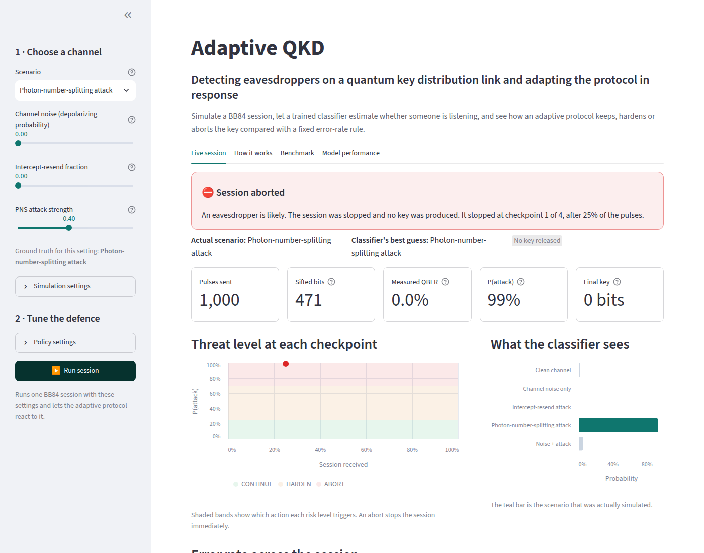
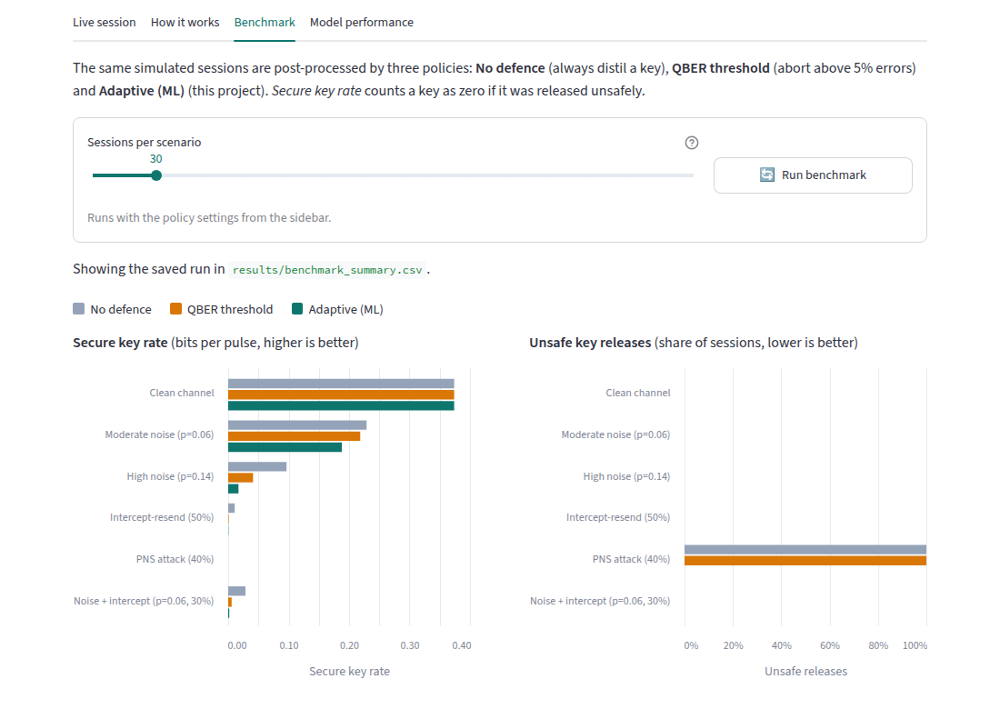
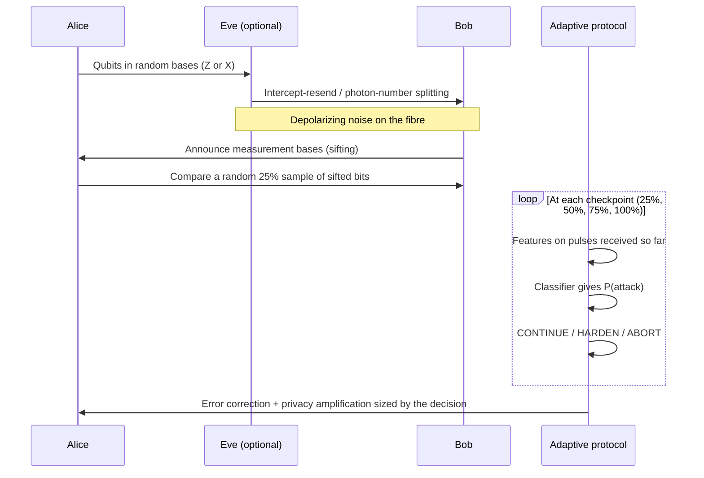
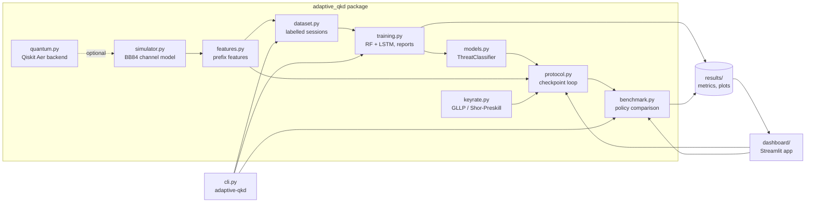

# Adaptive QKD

**Machine-learning eavesdropping detection and an adaptive defence policy for BB84 quantum key distribution.**

[](https://github.com/sakshamg251206/Adaptive_QKD/actions/workflows/ci.yml)


Adaptive QKD simulates the BB84 quantum key distribution protocol under channel noise and two kinds of
eavesdropping attack. A classifier trained on the simulated sessions estimates whether an eavesdropper is
present, and a closed-loop protocol uses that estimate to **keep, harden or abort** each key. The defence is
compared against the usual fixed error-rate rule. Everything can be explored in an interactive dashboard.



<sub>A photon-number-splitting attack produces **0% errors**, so an error-rate rule cannot see it. The
classifier flags it from other signals after 25% of the session, and the protocol aborts before any key is released.</sub>

---

## Contents

- [The idea in plain language](#the-idea-in-plain-language)
- [Features](#features)
- [Results](#results)
- [How it works](#how-it-works)
- [Architecture](#architecture)
- [Getting started](#getting-started)
- [Usage](#usage)
- [Configuration](#configuration)
- [Testing and quality checks](#testing-and-quality-checks)
- [Deployment](#deployment)
- [Project structure](#project-structure)
- [Technical decisions](#technical-decisions)
- [Limitations and future work](#limitations-and-future-work)

## The idea in plain language

**Quantum key distribution (QKD)** lets two people, traditionally *Alice* and *Bob*, create a shared secret
key over an optical link. Its security comes from physics: measuring a quantum state disturbs it, so an
eavesdropper (*Eve*) leaves traces in the form of errors.

Reading those traces is hard in practice:

- **Real links are noisy.** Some errors are always present, even when nobody is listening.
- **Some attacks leave no errors.** In a *photon-number-splitting* (PNS) attack, Eve quietly copies pulses
  that accidentally contain more than one photon. The error rate does not change.

Most systems use one fixed rule: *abort if the quantum bit error rate (QBER) is above a threshold*. That rule
throws away good keys on noisy links and does nothing against attacks that cause no errors.

This project asks whether a classifier that looks at several statistical fingerprints of a session can tell
these situations apart, and whether a protocol driven by that classifier produces **safer keys** than the
fixed rule.

## Features

- **BB84 simulator** with depolarizing noise, intercept-resend and photon-number-splitting attacks. It has
  two interchangeable physics backends: a vectorised NumPy model (10,000 sessions in under 10 s) and a
  **Qiskit Aer** quantum-circuit implementation used to cross-check it.
- **Labelled dataset generator**: 10,000 sessions across 5 classes. Each session is recorded at four
  checkpoints, so the model also learns what partial sessions look like.
- **Classifiers**: a Random Forest on session features (used by the protocol), and an LSTM on the QBER
  time series alone, kept as an ablation.
- **Adaptive protocol** that re-evaluates the threat at each checkpoint and chooses `CONTINUE`, `HARDEN` or
  `ABORT`.
- **Security-aware benchmark**: every released key is checked against the length that is actually secure
  for the true channel (asymptotic GLLP / Shor–Preskill bounds), so *unsafe* releases are counted rather
  than hidden.
- **Interactive Streamlit dashboard** with scenario presets, tunable policy thresholds, a plain-language
  explainer, benchmark charts and model diagnostics. It works before any model is trained.
- **Command-line interface**, a 56-test suite (≈87% coverage), strict type checking, linting and CI.

## Results

All numbers below come from `adaptive-qkd pipeline` with the default seed and are stored in
[`results/`](results/). They describe the simulator, not a physical QKD system (see
[Limitations](#limitations-and-future-work)).

### Classifier (2,000 held-out sessions)

| Model | Accuracy (5 classes) | Attack-detection ROC-AUC |
| --- | --- | --- |
| Random Forest (session features) | 80.0% | 0.983 |
| LSTM (QBER sequence only) | 51.6% | 0.720 |

- Deciding **whether** a session is attacked is reliable (ROC-AUC 0.98, and still 0.98 after seeing only
  25% of a session).
- Deciding **which** attack is harder. Most errors come from confusing *intercept-resend* with *noise +
  attack*, because a noisy intercept-resend session genuinely is both.
- The LSTM sees only the error-rate sequence, so it cannot separate a clean channel from a PNS attack
  (both show zero errors). That gap is why the other signals matter.

Full per-class metrics: [`results/metrics.md`](results/metrics.md).

### Defence policies (200 sessions of 1,000 pulses per scenario)

*Secure key rate* is secret bits per transmitted pulse, counting any unsafely released key as zero.

| Scenario | No defence | QBER threshold (5%) | Adaptive (ML) | Unsafe releases (No defence / Threshold / Adaptive) |
| --- | --- | --- | --- | --- |
| Clean channel | 0.374 | 0.374 | 0.374 | 0% / 0% / 0% |
| Moderate noise (QBER ≈ 3%) | 0.229 | 0.218 | 0.188 | 0% / 0% / 0% |
| High noise (QBER ≈ 7%) | 0.097 | 0.041 | 0.017 | 0% / 0% / 0% |
| Intercept-resend 50% | 0.011 | 0.001 | 0.000 | 0% / 0% / 0% |
| **PNS attack 40%** | 0.000 | 0.000 | 0.000 | **100% / 100% / 0%** |
| Noise + intercept-resend | 0.029 | 0.006 | 0.002 | 0% / 0% / 0% |



**What this shows, honestly:**

1. **The adaptive policy closes the PNS gap.** Both error-rate-based policies released a key in every PNS
   session, and Eve knew part of each one. The adaptive policy aborted every PNS session.
2. **Against intercept-resend, error-based privacy amplification already works.** The attack raises the
   QBER and the key is shortened accordingly, so all three policies stay safe.
3. **Caution costs key rate on noisy links.** The classifier sometimes mistakes strong noise for noise plus
   a weak attack, so the adaptive policy hardens or aborts more often than strictly needed. The thresholds
   are configurable, and the dashboard lets you explore the trade-off.

Full table with abort and harden rates: [`results/benchmark.md`](results/benchmark.md).

## How it works



**1. Simulation.** Alice sends random bits in random bases. Eve may intercept-resend a fraction of pulses
(adding up to 25% errors) or mount a PNS attack (blocking some pulses and learning others without adding
errors). Depolarizing noise flips each bit with probability *p/2*. Bob measures in random bases, and the
two keep only matching-basis bits (*sifting*).

**2. Features.** Every feature is a rate, so it can be computed on a partial session:

| Feature | Meaning |
| --- | --- |
| `qber`, `qber_std`, `qber_min`, `qber_max` | Error rate on the disclosed test bits, and its spread across time windows |
| `sifting_ratio` | Share of pulses that survive sifting; drops when Eve blocks pulses |
| `basis_mismatch_rate` | Share of detected pulses measured in the wrong basis |
| `timing_jitter_ns` | **Synthetic** detector timing side-channel (see limitations) |

**3. Decision.** `P(attack)` is the classifier's total probability on the three attack classes:

| P(attack) | Action | Effect on the key |
| --- | --- | --- |
| < 0.25 | `CONTINUE` | Standard privacy amplification: *r = 1 − h(e) − f·h(e)* |
| 0.25 – 0.70 | `HARDEN` | Assume 50% of the key is known to Eve (GLLP with tagged fraction Δ = 0.5) |
| ≥ 0.70 | `ABORT` | Stop immediately; no key |

An abort is final. Otherwise the decision is re-evaluated as evidence accumulates, and the last checkpoint
decides how the key is processed.

**4. Scoring.** The simulator knows the true channel, so for every released key it computes the secure
length using the true PNS fraction. Releasing more than that counts as **unsafe**.

## Architecture



**Tech stack:** Python 3.10+, NumPy, pandas, scikit-learn, Qiskit + Qiskit Aer (optional), PyTorch
(optional), Streamlit + Altair, Matplotlib, pytest, Ruff, mypy, and GitHub Actions.

## Getting started

Prerequisites: Python 3.10 or newer and `git`.

```bash
git clone https://github.com/sakshamg251206/Adaptive_QKD.git
cd Adaptive_QKD
python -m venv .venv && source .venv/bin/activate      # Windows: .venv\Scripts\activate
pip install -e ".[dashboard,dev]"
```

Optional extras:

| Extra | Adds | Needed for |
| --- | --- | --- |
| `dashboard` | Streamlit, Altair | The web dashboard |
| `quantum` | Qiskit, Qiskit Aer | The quantum-circuit backend |
| `lstm` | PyTorch | Training the LSTM ablation |
| `dev` | pytest, Ruff, mypy | Tests and checks |

To install everything: `pip install -e ".[dashboard,quantum,lstm,dev]"`, or run `make install-full`.

## Usage

### Dashboard

```bash
streamlit run dashboard/app.py          # or: make dashboard
```

Open <http://localhost:8501>. The app opens with an example session. If no model has been trained yet,
it says so and offers a **Train classifier now** button (about 15 s); until then it falls back to an
error-rate heuristic.

### Command line

```bash
adaptive-qkd pipeline                   # generate data, train, benchmark (~1-2 min)

adaptive-qkd generate                   # 10,000 sessions  -> data/
adaptive-qkd train                      # RF (+ LSTM if PyTorch is installed) -> models/, results/
adaptive-qkd train --no-lstm            # Random Forest only
adaptive-qkd benchmark --sessions 200   # policy comparison -> results/

adaptive-qkd simulate --intercept 1.0 --seed 1            # inspect one session
adaptive-qkd simulate --noise 0.1 --backend qiskit        # same, on Qiskit Aer
```

Run `adaptive-qkd <command> --help` for every option. `python -m adaptive_qkd` works too.

### As a library

```python
from adaptive_qkd import BB84Simulator, ChannelParams
from adaptive_qkd.protocol import AdaptiveQKDProtocol

trace = BB84Simulator(num_qubits=1000, seed=7).simulate(ChannelParams(pns_prob=0.4))
result = AdaptiveQKDProtocol.from_paths().run(trace)
print(result.final_action.name, result.outcome.released_bits, result.outcome.unsafe)
```

## Configuration

No secrets or API keys are needed. Three optional environment variables relocate generated files (see
[`.env.example`](.env.example)):

| Variable | Default | Contents |
| --- | --- | --- |
| `ADAPTIVE_QKD_DATA_DIR` | `data/` | Simulated dataset (CSV + NPZ) |
| `ADAPTIVE_QKD_MODEL_DIR` | `models/` | Trained classifiers |
| `ADAPTIVE_QKD_RESULTS_DIR` | `results/` | Metrics, benchmark tables and plots |

Defaults are resolved against the repository root. `data/` and `models/` are reproducible and are not
committed; `results/` is committed so the dashboard and this README show real numbers right after cloning.

## Testing and quality checks

```bash
make check          # everything CI runs: lint + typecheck + tests
make test           # pytest with coverage
make lint           # ruff check + ruff format --check
make typecheck      # mypy --strict
```

The suite covers the simulator against analytic QBER values (for example 25% under full intercept-resend),
agreement between the Qiskit and NumPy backends, feature extraction on partial sessions, the key-rate
formulas, protocol decisions, the training and benchmark pipeline end to end, the CLI, and the dashboard
through Streamlit's `AppTest`. Tests that need an optional extra are skipped when it is not installed.

[CI](.github/workflows/ci.yml) runs linting and type checking, plus the tests on Python 3.10 and 3.12 with
all extras installed.

## Deployment

The dashboard is a standard Streamlit app.

- **Streamlit Community Cloud:** point a new app at this repository with main file `dashboard/app.py`. The
  root [`requirements.txt`](requirements.txt) installs the package with the `dashboard` extra. On first
  visit, press **Train classifier now**. Model files are written to local disk, which is ephemeral on that
  platform, so set `ADAPTIVE_QKD_MODEL_DIR` to a writable path if the default is read-only.
- **Any server or container:** `pip install ".[dashboard]"`, run `adaptive-qkd generate && adaptive-qkd train --no-lstm`
  once, then `streamlit run dashboard/app.py --server.port 8501 --server.address 0.0.0.0`.

Model files are Python pickles (via `joblib`/`torch.save`). Only load model files you generated yourself.

## Project structure

```
.
├── src/adaptive_qkd/
│   ├── simulator.py     # BB84 channel model: noise, intercept-resend, PNS
│   ├── quantum.py       # Qiskit Aer circuit backend (optional)
│   ├── features.py      # Feature extraction on full or partial sessions
│   ├── dataset.py       # Labelled dataset generation and I/O
│   ├── models.py        # Random Forest wrapper and LSTM definition
│   ├── training.py      # Training, evaluation, reports and plots
│   ├── keyrate.py       # Binary entropy, GLLP / Shor-Preskill secret fraction
│   ├── protocol.py      # Checkpointed adaptive protocol and key finalisation
│   ├── benchmark.py     # Defence-policy comparison
│   ├── config.py        # Constants, class names, paths from environment
│   └── cli.py           # `adaptive-qkd` command
├── dashboard/
│   ├── app.py           # Streamlit app
│   └── charts.py        # Altair charts
├── tests/               # pytest suite
├── results/             # Committed metrics, benchmark tables and plots
├── docs/                # Technical report and screenshots
├── .github/workflows/   # CI
├── pyproject.toml       # Package metadata, dependencies, tool configuration
├── Makefile             # Developer shortcuts
└── requirements.txt     # For hosts that install from requirements.txt
```

## Technical decisions

- **Two physics backends.** Qiskit is the trustworthy reference, but building and running a circuit per
  session is far too slow for 10,000 sessions. The vectorised NumPy model generates the dataset, and tests
  check it against both theory and the Qiskit backend.
- **Rates only, no absolute counts, as features.** Absolute counts such as sifted-key length depend on
  session length, which varies. Rates are length-independent, so the same model serves full and partial
  sessions.
- **Training on checkpoints.** The protocol must decide after seeing only 25% of a session. Training only
  on full sessions made early decisions over-confident and aborted noisy-but-safe sessions. Recording each
  session at all four checkpoints, and splitting train and test **by session** to avoid leakage, fixed
  this.
- **Scoring safety, not just key length.** Comparing raw key rates rewards policies that release insecure
  keys. Scoring each release against the true channel's secure length (GLLP) makes the comparison honest.
- **Benchmark sessions never overlap training sessions.** They use a disjoint seed range.
- **Random Forest over deep learning for the protocol.** It is accurate on tabular features, fast at
  single-session inference, and interpretable through feature importances. The LSTM is kept as an
  ablation to show what the error-rate sequence alone can and cannot reveal.

The [technical report](docs/technical-report.md) covers the physics and the formulas in more depth.

## Limitations and future work

- **Synthetic timing signal.** `timing_jitter_ns` is a modelling assumption, not a measured detector
  characteristic. It is the most important feature, and much of the PNS detection relies on it together
  with the drop in sifting ratio. Results would change on real hardware telemetry.
- **Simplified PNS model.** Photon-number statistics are modelled phenomenologically (detection loss plus a
  known fraction). A full weak-coherent-pulse model with decoy states, the standard real-world defence
  against PNS, is a natural next step.
- **Asymptotic key rates.** Finite-key corrections, which matter for 1,000-pulse sessions, are not modelled.
- **Simulation only.** The classifier has never seen data from a physical QKD link.
- **Caution on noisy channels.** The adaptive policy loses key rate under strong noise. Cost-sensitive
  training or calibrated thresholds per noise level could reduce this.

## License

[MIT](LICENSE) © Saksham Garg
